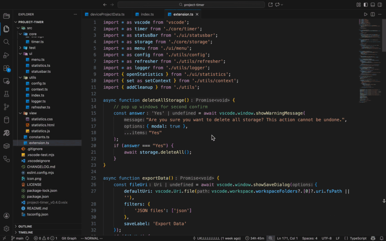
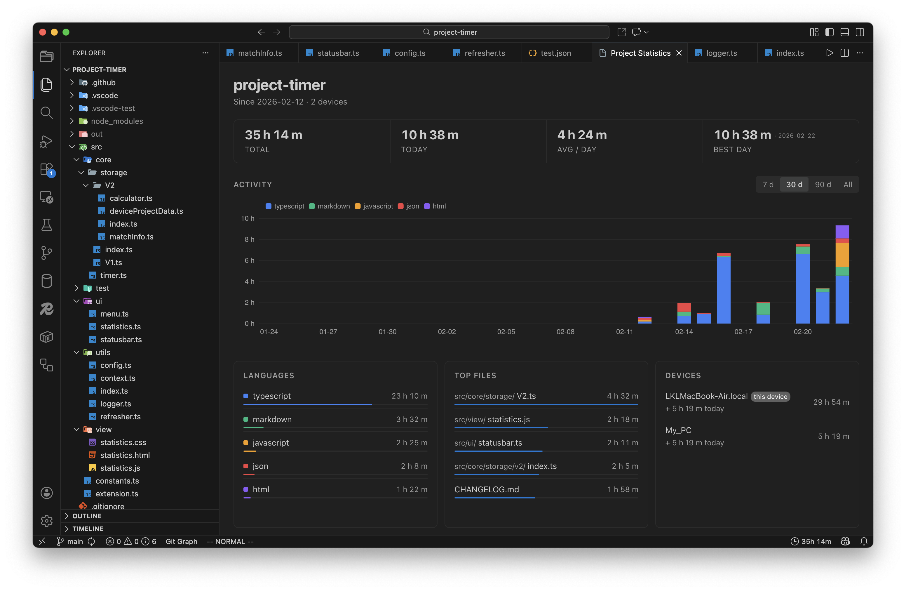

# Project Timer

Project Timer is a lightweight VS Code extension that tracks the time you spend on your projects. It provides detailed insights into your productivity by analyzing your coding activity by dates, programming languages and specific files.

<div align="center">
    
</div>

## Feature

- **Privacy-first Storage**: Stores data locally in VS Code; synchronization happens only through Settings Sync if enabled.
- **Cross-device synchronization**: Optionally, you can enable synchronization across multiple devices using VS Code Settings Sync.
- **Real-time Status Bar Timer**: Displays a timer in the VS Code status bar showing your progress in real-time. The display format is customizable.
- **Smart Idle Detection**: Automatically pauses the timer when you are inactive for a configurable duration.
- **Visual Statistics**: Provides a comprehensive webview with charts and insights into your coding habits.

<div align="center">
    
</div>

## Usage

Simply open a folder or workspace, and **Project Timer** will begin tracking. The timer will appear in the status bar. Hover over the status bar item to see a preview of today's time tracking. Click on the status bar item to quickly open the statistics view.

*Note: On the first launch of this version, you will be prompted to choose whether to enable synchronization.*

## Extension Settings

This extension contributes the following settings:

- `project-timer.statusBar.enabled`: Enable or disable the status bar timer.
- `project-timer.statusBar.displayPrecision`: Set time precision to `second`, `minute`, `hour`, or `auto`.
- `project-timer.statusBar.displayProjectName`: Toggle the visibility of the project name in the status bar.
- `project-timer.statusBar.displayTimeMode`: Set the display mode to `today`, `total`, or `both`.
- `project-timer.timer.pauseWhenUnfocused`: Automatically pause the timer when VS Code is not the active window.
- `project-timer.timer.unfocusedThreshold`: Set the threshold (in minutes) for unfocused pause. If the window is unfocused for longer than this threshold, the timer will pause.
- `project-timer.timer.pauseWhenIdle`: Automatically pause the timer when user is idle.
- `project-timer.timer.idleThreshold`: Set the idle time threshold (in minutes) after which the timer pauses. Set to `0` to disable.
- `project-timer.synchronization.enabled`: Enable or disable data synchronization via VS Code Settings Sync.
- `project-timer.synchronization.syncedProjects`: The list of projects that are tracked for synchronization.

## Commands

- `Project Timer: Open Statistics`: View your project's time tracking dashboard.
- `Project Timer: Export Data`: Save your tracking history to a JSON file.
- `Project Timer: Import Data`: Load tracking history from a previously exported JSON file.
- `Project Timer: Delete All Storage`: Clear all local tracking data, both current device and remote devices (requires confirmation).
- `Project Timer: Rename Project`: Rename the current project.
- `Project Timer: Disable Sync For Current Project`: Disable synchronization for the current project.
- `Project Timer: Enable Sync For Current Project`: Enable synchronization for the current project.

## Resources

- [Project Timer in VS Code Marketplace](https://marketplace.visualstudio.com/items?itemName=LKL.project-timer)
- [Project Timer github repository](https://github.com/kunlinglio/project-timer) 
- [Download VSIX](https://github.com/kunlinglio/project-timer/releases)
- [Project Timer icon](https://pictogrammers.com/library/mdi/icon/timeline-clock-outline/)

## Development

1. clone repository
    ```bash
    git clone https://github.com/kunlinglio/project-timer.git
    cd project-timer
    ```
2. install dependencies
    ```bash
    npm install
    ```
3. debug extension  
    Press F5 to toggle debug mode.
4. build VSIX
    ```bash
    npm run build
    ```
5. run checks (compile, lint, test)
    ```bash
    npm run pretest
    npm run test
    ```
6. release
    - release on github
        ```bash
        git tag vX.X.X
        git push origin vX.X.X # Toggle github action to release
        ```
    - release on marketplace
        ```bash
        npm run build -- -o project-timer_vX.X.X.vsix
        ```
        Then manually upload to [Marketplace](https://marketplace.visualstudio.com/manage).

## TODO

- [x] Support data synchronization across multiple devices.
- [x] Support more identifiers to recognize project, e.g. workspace name / workspace folder / git repo url...
- [x] Support project name customization.
- [x] Support VS Code remote window (e.g. SSH, Dev Containers).
- [ ] Support upgrade workspace folder to multi-root workspace.
- [ ] Support time period statistics (weekly/monthly reports).
- [ ] Support viewing statistics for all projects on device instead of current project only.

## License
Distributed under the terms of the Apache 2.0 license.

## Release Notes

### 0.5.1
- **Added support for VS Code remote windows**: Now tracks time seamlessly in Remote SSH, Dev Containers, and WSL sessions.
- Fixed an issue where the description for `project-timer.multiRootWorkspace.warningMessage.enable` was displayed incorrectly in settings.

### 0.5.0
- Improved multi-root workspace UX: the warning dialog now offers "Ok" and "Don't show again" actions.
- Added configuration: project-timer.multiRootWorkspace.warningMessage.enable to enable/disable that warning.
- Removed stray console logs when not in debug mode.
- Fixed an activation crash caused by reaching max stack size.

### 0.4.3
- Enhanced the "Top Files" panel in the statistics view: you can now click on a file path to jump directly to the corresponding file in the editor.
- Fixed a bug where the statistics webview might remain in a `loading` state after refreshing the window or reloading the extension.

### 0.4.2
- Improved the statistics view by grouping languages outside the top 5 into a new `other` category for better clarity.
- Refined activity detection: window focused and unfocused events are no longer treated as user activity, preventing the timer from starting unexpectedly.
- Optimized internal logic sequence to slightly improve extension performance.

### 0.4.1
- Bundled the ECharts library within the extension package. This ensures the statistics dashboard works reliably offline and eliminates dependencies on external CDNs.

### 0.4.0
- **Restored data synchronization service by default**, resolving previous consistency concerns with a more robust implementation.
- Introduced per-project sync controls: You can now use commands to Enable or Disable synchronization for specific projects as needed.
- A dded a new management configuration project-timer.synchronization.syncedProjects that provides a readable overview of all projects currently participating in sync.
- UI Accessibility Improvements:
    - Added a vertical scrollbar to the Statistics Page to ensure full accessibility on low-resolution or smaller screens.
    - Refined the overall layout of the dashboard for better visual balance and clarity.

### 0.3.2
- Resolved a issue on the Windows platform where the extension failed to activate due to parent path parsing errors.
- Error messages and stack traces are now correctly logged to the VS Code `Output` panel for easier troubleshooting.
- **Temporarily disabled the synchronization feature** to prevent potential data consistency issues.

### 0.3.1
- Improved UI responsiveness: The status bar and menus now refresh immediately after data management operations (Delete, Import, Rename).
- Updated extension icon color to a blue theme (#007FD4).

### 0.3.0
- Force-refreshes all cached data 5 seconds after startup to ensure the Git remote URL is resolved correctly.
- Added diagnostic logging to the VS Code Output panel.
- Redesigned statistics dashboard with an improved layout and new insights:
    - KPI strip showing Total, Today, Avg / Day, and Best Day.
    - Activity chart with 7d / 30d / 90d / All range tabs; the All view fills the complete calendar range including gap days.
    - Languages and Top Files panels auto-fit to available space, with a coloured progress bar per entry.
    - Devices panel appears automatically when data from multiple devices is detected.
    - Responsive layout that stacks panels vertically on narrow viewports.

### 0.2.2
- Fixed an issue where the Git remote URL could not be retrieved correctly.
- Fixed incorrect refresh frequency when `displayTimeMode` is set to `Both`.
- Further reduced background CPU usage by lowering refresh frequency for the status bar, hover menu, and time calculator.
- The `today` value in the status bar and hover menu now consistently reflects local device data only.

### 0.2.1
- **Performance enhancement**: Implemented caching and reduced refresh frequency to reduce power consumption (approx. 50% reduction in idle state).
- Increased status bar item priority.
- Resolved latency in status bar icon refreshes.
- Fixed multi-project record display issues.
- Fixed time calculation to use local time instead of UTC for accurate daily statistics.

### 0.2.0
- Added Git remote URL matching for more accurate cross-device project recognition.
- Added support for customizing project display names.
- Optimized status bar performance with a new caching layer.

### 0.1.1
- Introduced Storage cache system to improve performance.
- Fixed timer remaining at 0/1s when multiple windows were open simultaneously.
- Fixed issue where statistics were incorrectly merged when multiple project folders existed under the same parent directory.

### 0.1.0
- Introduced V2 data storage structure with automatic migration from V1.
- Added **synchronization** support via VS Code Settings Sync.
- Added a one-time prompt to choose synchronization preference on startup.
- Refined Import, Export, and Delete command behaviors for multi-device data management.
- Fixed a bug where the status bar timer failed to refresh periodically.

### 0.0.2
- Improved time tracking precision with new setting items.
- Refactored status bar display modes for better customization.
- UI refinements and optimized default configurations.

### 0.0.1
- Initial release of Project Timer.
- Automatic time tracking with idle detection and focus awareness.
- Visual statistics dashboard.
- Data export/import and management tools.
